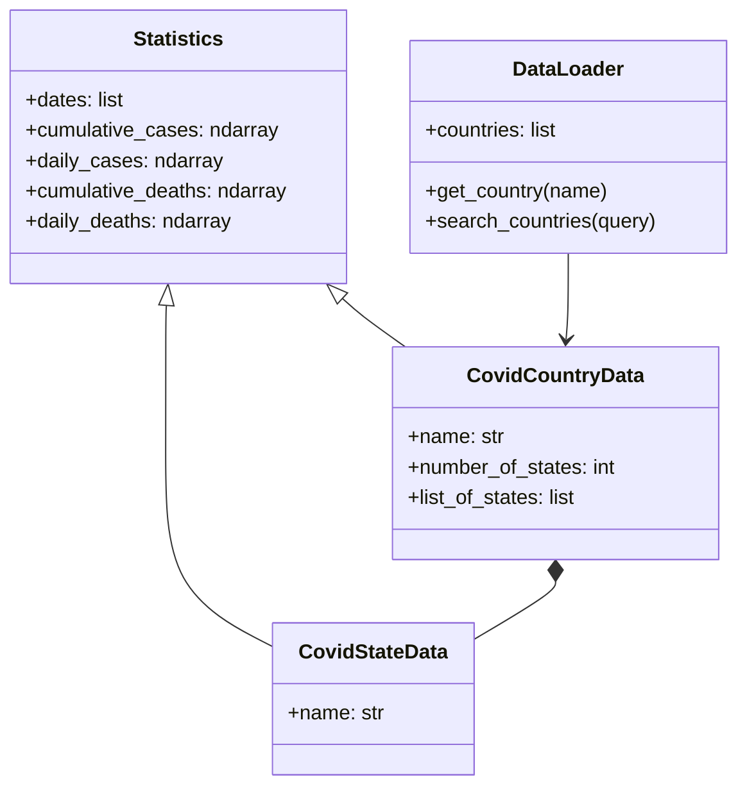

<p align="center">
  
  
  
  
  
</p>

# 🦠 COVID-19 Data Visualization App

A professional desktop application for visualizing global COVID-19 pandemic data, built with **Python**, **PyQt5**, and **Matplotlib**. Features an interactive dark-themed GUI with real-time search, dynamic charts, moving average smoothing, and date range filtering.

> **Origin:** Ported and enhanced from the final project of [Mastering Programming with MATLAB](https://www.coursera.org/learn/advanced-matlab-programming) (Vanderbilt University, Coursera). The original MATLAB App Designer application was rebuilt from the ground up in Python using object-oriented design.

<!-- SCREENSHOT PLACEHOLDER — replace with your own screenshot -->
<!--  -->

---

## ✨ Features

| Feature | Description |
|---------|-------------|
| 🌍 **Country Browser** | Browse data for **191 countries** with a scrollable, searchable list |
| 🏛️ **State/Region Drill-Down** | View state-level breakdowns for 8 countries (US, China, Canada, Australia, etc.) |
| 📊 **Cases & Deaths Charts** | Interactive line charts with gradient fills — view Cases, Deaths, or Both simultaneously |
| 📈 **Cumulative / Daily Toggle** | Switch between cumulative totals and daily new counts |
| 📉 **Moving Average** | Adjustable smoothing window from 1 to 15 days to reveal trends |
| 🔍 **Real-Time Search** | Instantly filter the country list as you type |
| 📅 **Date Range Picker** | Focus on any time period with calendar-based start/end date selectors |
| 🔄 **Clear & Reset** | One-click buttons to clear search or reset all controls to defaults |
| 🧭 **Chart Toolbar** | Built-in Matplotlib toolbar for zoom, pan, and exporting charts as images |
| 🌙 **Dark Theme** | Premium dark UI inspired by GitHub's design system |

---

## 🏗️ Architecture

The application follows an **object-oriented design** with a clean class hierarchy:

```
Statistics (Base Class)
├── CovidCountryData    — country-level aggregate data + child states
└── CovidStateData      — individual state/region data
```



---

## 📂 Project Structure

```
Covid_app/
├── main.py                  # PyQt5 GUI application (entry point)
├── models.py                # OOP data models (Statistics, CovidCountryData, CovidStateData)
├── convert_mat_to_json.py   # One-time MATLAB .mat → JSON converter
├── covid_data.json          # Parsed dataset (191 countries × 375 dates)
├── covid_data.mat           # Original MATLAB data (Jan 22, 2020 – Jan 30, 2021)
├── README.md
│
├── CovidCountryData.m       # Original MATLAB class (reference)
├── CovidStateData.m         # Original MATLAB class (reference)
└── Statistics.m             # Original MATLAB class (reference)
```

---

## 🚀 Getting Started

### Prerequisites

- Python 3.10 or higher
- pip (Python package manager)

### Installation

1. **Clone the repository**
   ```bash
   git clone https://github.com/YOUR_USERNAME/Covid19-Data-Visualization.git
   cd Covid19-Data-Visualization
   ```

2. **Install dependencies**
   ```bash
   pip install PyQt5 matplotlib numpy scipy
   ```

3. **Run the application**
   ```bash
   python main.py
   ```

> **Note:** The `covid_data.json` file is pre-generated and included. If you want to regenerate it from the original MATLAB `.mat` file, run:
> ```bash
> python convert_mat_to_json.py
> ```

---

## 🎨 UI Design

The interface uses a **premium dark theme** with carefully curated colors:

| Element | Color | Purpose |
|---------|-------|---------|
| Background | `#0d1117` | Deep dark base |
| Panels | `#161b22` | Elevated surfaces |
| Borders | `#30363d` | Subtle separation |
| Cases line | `#58a6ff` | Blue accent for cases data |
| Deaths line | `#f85149` | Red accent for deaths data |
| Highlights | `#388bfd` | Interactive element focus |
| Text | `#e6edf3` | High-contrast readability |

### UI Components
- **Glassmorphism** group boxes with translucent backgrounds
- **Gradient-accented** buttons (green, purple, red)
- **Custom-styled** radio buttons, sliders, and date pickers
- **Responsive layout** with fixed sidebars and stretching chart area

---

## 🔧 How It Works

1. **Data Loading** — `DataLoader` reads `covid_data.json` and constructs the object hierarchy
2. **Country Selection** — Clicking a country in the list populates the state list and updates the chart
3. **State Drill-Down** — For countries with state data, selecting a state shows state-specific data
4. **Chart Rendering** — Matplotlib renders the chart with the selected data type, mode, moving average, and date range
5. **Search** — Real-time filtering narrows the country list as you type

### Data Pipeline

```
covid_data.mat (MATLAB binary)
        │
        ▼  [convert_mat_to_json.py]
covid_data.json (structured JSON)
        │
        ▼  [models.py → DataLoader]
Python objects (Statistics → CovidCountryData/CovidStateData)
        │
        ▼  [main.py → MplCanvas]
Interactive PyQt5 GUI with Matplotlib charts
```

---

## 📊 Dataset

- **Source:** [Johns Hopkins University Coronavirus Resource Center](https://coronavirus.jhu.edu/map.html)
- **Coverage:** January 22, 2020 — January 30, 2021
- **Countries:** 191
- **Countries with state-level data:** 8 (US, China, Canada, Australia, etc.)
- **Data points per country:** 375 days × 2 metrics (cases, deaths)

---

## 🛠️ Technologies Used

| Technology | Usage |
|------------|-------|
| **Python 3** | Core programming language |
| **PyQt5** | Desktop GUI framework |
| **Matplotlib** | Data visualization & charting |
| **NumPy** | Numerical computation (moving averages, diffs) |
| **SciPy** | MATLAB `.mat` file parsing |

---

## 📝 MATLAB → Python Mapping

This project is a faithful port of the original MATLAB application. Here's how each component was translated:

| MATLAB (Original) | Python (Port) |
|--------------------|---------------|
| `Statistics.m` (handle class) | `Statistics` (Python class with NumPy) |
| `CovidCountryData.m` | `CovidCountryData(Statistics)` |
| `CovidStateData.m` | `CovidStateData(Statistics)` |
| `MyCovid19App.mlapp` (App Designer) | `main.py` (PyQt5 + Matplotlib) |
| `covid_data.mat` (cell array) | `covid_data.json` (structured JSON) |
| `diff()` + negative clamping | `np.diff()` + boolean masking |
| MATLAB axes | `MplCanvas(FigureCanvas)` |
| `uicontrol` widgets | PyQt5 widgets (`QListWidget`, `QRadioButton`, etc.) |

---

## 🤝 Contributing

Contributions are welcome! Feel free to:

1. Fork the repository
2. Create a feature branch (`git checkout -b feature/new-feature`)
3. Commit your changes (`git commit -m 'Add new feature'`)
4. Push to the branch (`git push origin feature/new-feature`)
5. Open a Pull Request

---

## 📄 License

This project is licensed under the MIT License — see the [LICENSE](LICENSE) file for details.

---
---

## 📄 Overview


---

## 🙏 Acknowledgments

- **Vanderbilt University** — [Mastering Programming with MATLAB](https://www.coursera.org/learn/advanced-matlab-programming) course on Coursera
- **Mike Fitzpatrick** — Course instructor
- **Johns Hopkins University** — [Coronavirus Resource Center](https://coronavirus.jhu.edu/map.html) for the dataset
- Original MATLAB implementation reference: [huaminghuangtw/Coursera-Mastering-Programming-with-MATLAB](https://github.com/huaminghuangtw/Coursera-Mastering-Programming-with-MATLAB)

---

<p align="center">
  Made with ❤️ using Python & PyQt5
</p>
